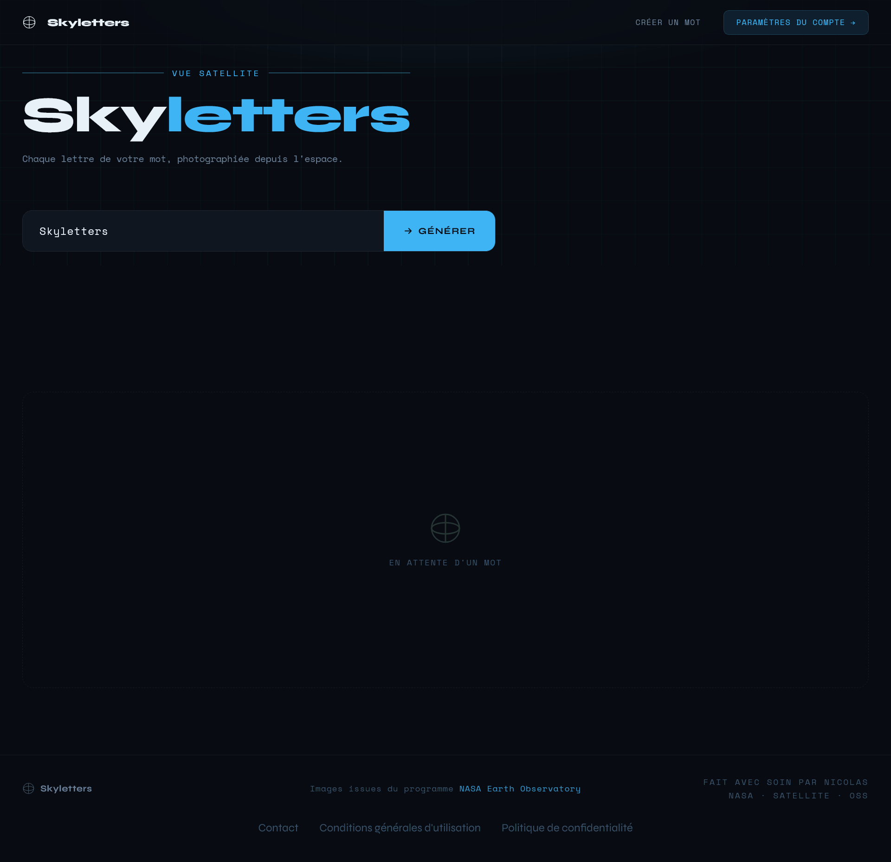

# Salut, moi c’est Nico 👋

Je suis un lycéen français, qui m'amuse à créer applications, site web, et même parfois à décortiquer des applications connues, telles que Spotify.

## Mon principal projet :

Depuis maintenant un an, je développe une web-app nommée **Skyletters**, qui permet d'écrire des mots, grâce à des lettres formées par des rivières, reliefs, golfes etc., le tout capturé par **satellite**.

Pour tester dès maintenant ce service, rendez-vous sur [skyletters.netlify.app](https://skyletters.netlify.app?utm_source=github.com&utm_medium=nduquenoy%252Fnduquenoy%252FREADME.md&utm_content=direct-link).

Ce site est donc bien évidement *gratuit*, et si vous aimez, n'hésitez pas à en **parler autour de vous !**
 *De plus, une application mobile devrait être bientôt disponible*…

 Voici un extrait de l'interface :  

<!--  : [skyletters.netlify.app](https://skyletters.netlify.app?utm_source=github.com&utm_medium=nduquenoy%252Fnduquenoy%252FREADME.md&utm_content=ui-demo-placeholder-link)-->

    © Spotify est une marque déposée de Spotify AB
