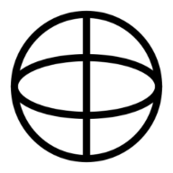

# Salut, moi c’est Nico 👋

Je suis un lycéen français, qui m'amuse à créer applications, site web, et même parfois à décortiquer des applications connues, telles que Spotify.

# Mon principal projet

Depuis maintenant un an, je développe une web-app nommée Skyletters, qui permet d'écrire des mots, grâce à des lettres formées par des rivières, reliefs, golfes etc, le tout capturé par satellite.

© Spotify est une marque déposée de Spotify AB